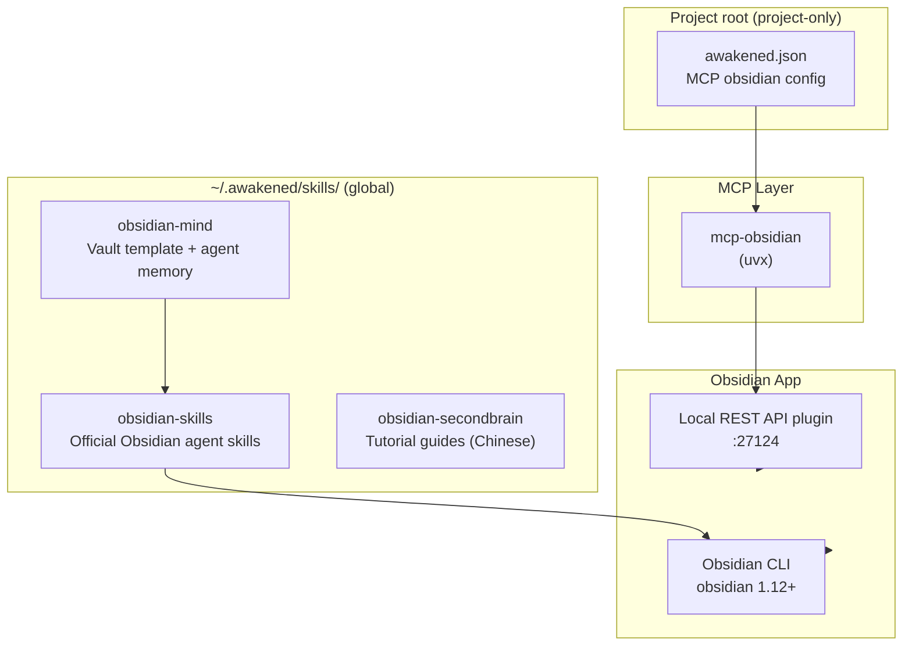
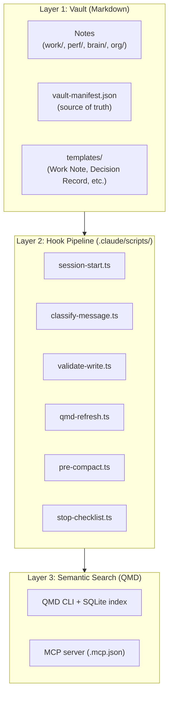
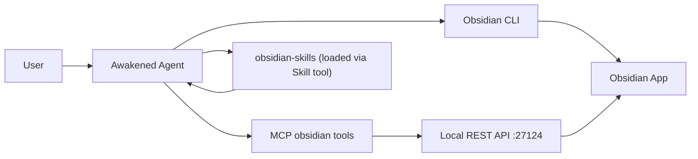
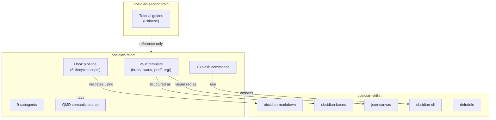

# Obsidian Skills Architecture

## Overview

Three Obsidian-related skills are installed globally at `~/.awakened/skills/`. Each serves a different purpose in the Obsidian + AI agent ecosystem.



---

## Skill Inventory

| Skill | Source | Stars | Purpose | Status |
|-------|--------|-------|---------|--------|
| **obsidian-mind** | `breferrari/obsidian-mind` | 2.7k | Full vault template with persistent memory, hooks, commands, subagents | Production-ready |
| **obsidian-skills** | `kepano/obsidian-skills` | 33.5k | Official Obsidian agent skills (Markdown, CLI, Bases, Canvas, Defuddle) | Production-ready |
| **obsidian-secondbrain** | `monkey1107-crypto/claude-obsidian-secondbrain` | 0 | Chinese-language tutorial guides | Reference only |

---

## 1. obsidian-mind (Vault Template)

**Path:** `~/.awakened/skills/obsidian-mind/`

A complete Obsidian vault that gives AI coding agents persistent memory. Built for Claude Code, with hooks for Codex CLI and Gemini CLI.

### Architecture Layers



### Vault Structure

```
obsidian-mind/
├── Home.md                    Entry point — embedded Base views
├── CLAUDE.md                  Operating manual (read every session)
├── AGENTS.md                  Multi-agent guide
├── vault-manifest.json        Template metadata + QMD index name
│
├── brain/                     Agent operational knowledge
│   ├── North Star.md          Goals — read every session
│   ├── Memories.md            Topic index
│   ├── Key Decisions.md
│   ├── Patterns.md
│   ├── Gotchas.md
│   └── Skills.md
│
├── work/                      Work notes
│   ├── Index.md               Map of Content
│   ├── active/                Current projects (1-3 files)
│   ├── archive/YYYY/          Completed work by year
│   ├── incidents/             Incident docs
│   ├── 1-1/                   Meeting notes
│   └── meetings/              Inbox for raw exports
│
├── perf/                      Performance tracking
│   ├── Brag Doc.md            Running log of wins
│   ├── brag/                  Quarterly brag notes
│   ├── competencies/          One note per competency
│   └── evidence/              PR deep scans
│
├── org/                       Organizational knowledge
│   ├── People & Context.md    MOC
│   ├── people/                One note per person
│   └── teams/                 One note per team
│
├── bases/                     Database views (.base files)
├── reference/                 Codebase knowledge
├── thinking/                  Scratchpad (delete after promoting)
├── templates/                 Obsidian templates
│
├── .claude/
│   ├── commands/              18 slash commands
│   ├── agents/                9 subagents
│   ├── scripts/               6 hook scripts
│   ├── skills/                Obsidian + QMD skills
│   └── settings.json          Hook configuration
│
├── .codex/                    Codex CLI hooks
├── .gemini/                   Gemini CLI hooks
└── .obsidian/                 Obsidian config
```

### Lifecycle Hooks

| Hook | When | What | Tokens |
|------|------|------|--------|
| **SessionStart** | On startup | Inject North Star, active work, git summary, tasks, file listing | ~2K |
| **UserPromptSubmit** | Every message | Classify content (decision, incident, win, 1:1) + routing hints | ~100 |
| **PostToolUse** | After `.md` write | Validate frontmatter + wikilinks | ~200 |
| **PreCompact** | Before compaction | Back up transcript to `thinking/session-logs/` | — |
| **Stop** | Session end | Lightweight checklist reminder | — |

### Slash Commands

| Command | Purpose |
|---------|---------|
| `/om-standup` | Morning kickoff — load context, review yesterday, priorities |
| `/om-dump` | Freeform capture — routes everything to the right notes |
| `/om-wrap-up` | Full session review — verify notes, indexes, links |
| `/om-humanize` | Voice-calibrated editing — make notes sound human |
| `/om-weekly` | Weekly synthesis — cross-session patterns, uncaptured wins |
| `/om-capture-1on1` | Capture 1:1 transcript into structured note |
| `/om-incident-capture` | Capture incident from Slack into structured notes |
| `/om-review-brief` | Generate review brief (manager or peer) |
| `/om-self-review` | Write self-assessment for review season |
| `/om-vault-audit` | Audit indexes, links, orphans, stale content |
| `/om-vault-upgrade` | Import content from another vault |
| `/om-prep-1on1` | Prep for upcoming 1:1 with context |
| `/om-meeting` | Prep for any meeting by topic |
| `/om-intake` | Process meeting notes inbox |
| `/om-project-archive` | Move completed project to archive |

### Subagents

| Agent | Purpose |
|-------|---------|
| `brag-spotter` | Finds uncaptured wins and competency gaps |
| `context-loader` | Loads all vault context about a person/project/concept |
| `cross-linker` | Finds missing wikilinks, orphans, broken backlinks |
| `people-profiler` | Bulk creates/updates person notes from Slack profiles |
| `review-prep` | Aggregates all performance evidence for a review period |
| `slack-archaeologist` | Full Slack reconstruction — every message, thread, profile |
| `vault-librarian` | Deep vault maintenance — orphans, broken links, stale notes |
| `review-fact-checker` | Verifies review draft claims against vault sources |
| `vault-migrator` | Classifies, transforms, migrates content from a source vault |

### Design Principles

1. **Graph-first, not folder-first** — folders group by purpose, links group by meaning
2. **Vault-first memory** — all durable knowledge lives in `brain/`, not `~/.claude/`
3. **Progressive disclosure** — ~2K tokens at start, semantic search on demand
4. **Agent-agnostic core** — hooks are pure TypeScript, no SDK dependencies

---

## 2. obsidian-skills (Official Skills)

**Path:** `~/.awakened/skills/obsidian-skills/`

Official Obsidian agent skills by kepano (Obsidian creator). Follows the Agent Skills specification.

### Skills

| Skill | File | Teaches |
|-------|------|---------|
| **obsidian-markdown** | `skills/obsidian-markdown/SKILL.md` | Wikilinks, embeds, callouts, properties, tags, comments, highlight syntax |
| **obsidian-bases** | `skills/obsidian-bases/SKILL.md` | `.base` files with views, filters, formulas, summaries |
| **json-canvas** | `skills/json-canvas/SKILL.md` | `.canvas` files with nodes, edges, groups, connections |
| **obsidian-cli** | `skills/obsidian-cli/SKILL.md` | CLI commands for vault operations, plugin dev, DOM inspection |
| **defuddle** | `skills/defuddle/SKILL.md` | Extract clean markdown from web pages via `defuddle parse <url> --md` |

### Reference Files

```
skills/obsidian-markdown/references/
├── CALLOUTS.md        All callout types + aliases + nesting
├── EMBEDS.md          Audio, video, search embeds, external images
└── PROPERTIES.md      All property types, tag syntax, advanced usage

skills/obsidian-bases/references/
└── FUNCTIONS_REFERENCE.md    All Base functions and formulas

skills/json-canvas/references/
└── EXAMPLES.md        Canvas file examples
```

### Obsidian CLI Quick Reference

```bash
obsidian read file="Note"                    Read a note
obsidian create name="Note" content="..."    Create note
obsidian append file="Note" content="..."    Append content
obsidian search query="term" limit=10        Search vault
obsidian daily:read / daily:append           Daily notes
obsidian property:set name="k" value="v"     Set properties
obsidian tasks daily todo                    List tasks
obsidian tags sort=count counts              List tags
obsidian backlinks file="Note"               Show backlinks
obsidian dev:errors                          Check plugin errors
obsidian dev:screenshot path=s.png           Visual check
obsidian eval code="app.vault.getFiles()"    Run JS in app
obsidian plugin:reload id=my-plugin          Reload plugin
```

---

## 3. obsidian-secondbrain (Tutorial Guides)

**Path:** `~/.awakened/skills/obsidian-secondbrain/`

Chinese-language tutorial content. Not a functional skill — reference material only.

| File | Content |
|------|---------|
| `03-??????-Obsidian.md` | Obsidian setup guide (Chinese) |
| `Auto Setup Second Brain-????????.md` | Second brain automation guide (Chinese) |

**Status:** Reference only. No SKILL.md, no hooks, no scripts.

---

## Integration with Awakened

### MCP Configuration (Project-Only)

The Obsidian REST API is configured at project level in `awakened.json`:

```json
{
  "mcp": {
    "obsidian": {
      "type": "local",
      "command": ["uvx", "mcp-obsidian"],
      "enabled": true,
      "environment": {
        "OBSIDIAN_API_KEY": "ebf16d...b183",
        "OBSIDIAN_HOST": "127.0.0.1",
        "OBSIDIAN_PORT": "27124"
      }
    }
  }
}
```

**Scope:** Project only (not in `~/.awakened/`). This means:
- MCP obsidian tools are available only when working in this project
- Global skills are available everywhere, but the REST API connection is project-scoped

### MCP Tools Available

| Tool | Purpose |
|------|---------|
| `list_files_in_vault` | List all files in vault root |
| `list_files_in_dir` | List files in a specific directory |
| `get_file_contents` | Read a single file |
| `search` | Simple text search across vault |
| `patch_content` | Insert content relative to heading/block/frontmatter |
| `append_content` | Append content to a file |
| `delete_file` | Delete a file or directory |

### Data Flow



### Skill Loading Strategy

| Task | Load Skill | Why |
|------|-----------|-----|
| Create/edit `.md` files | `obsidian-markdown` | Wikilinks, callouts, properties syntax |
| Run vault commands | `obsidian-cli` | CLI reference and patterns |
| Create `.base` files | `obsidian-bases` | View syntax, filters, formulas |
| Create `.canvas` files | `json-canvas` | Node/edge JSON structure |
| Extract web content | `defuddle` | Clean markdown from URLs |
| Full vault workflow | `obsidian` (Awakened built-in) | MCP setup + quick reference |

---

## Relationship Between Skills



**obsidian-mind** ships with **obsidian-skills** pre-installed in `.claude/skills/`. The mind template is the vault; the skills are the agent's knowledge of how to work with it.

---

## Extension Points

| Change | Where |
|--------|-------|
| Add a new note type | `vault-manifest.json` → `frontmatter_required` + template in `templates/` |
| Add a new classification | `.claude/scripts/classify-message.ts` + `CLAUDE.md` |
| Add a new slash command | `.claude/commands/om-*.md` |
| Add a new subagent | `.claude/agents/*.md` |
| Add a new Base view | `bases/*.base` + embed from `Home.md` |
| Add a new agent (Cursor, etc.) | New config file mapping events to existing scripts |
